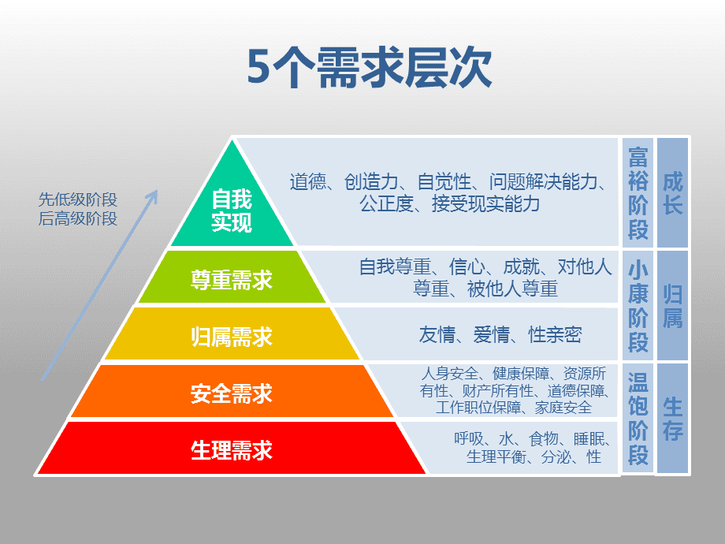

## 4.10
1. pingcode&jira（可以嵌入飞书，但是.....不知道怎么用）

2. flomo&cubox（flomo比较好用，可能因为比较间接，api丰富吧）

3. figma&mastergo&pixso（原型复杂一点了就变得好卡好慢）

4. 陪聊产业被裸聊和真实故事计划写了，奇怪，陪聊最近真的很火吗？想去试试！我还是可以装夹子音的！
	

## 4.11
1. [全栈设计师Jymbo拿Figma做作品集](https://www.figma.com/file/FrQCUHROxYmC20zuiC2iQ6/LYS-2.0---Medium-Public-link?node-id=0%3A1)
2. [微软开源了4个Github课程](https://mp.weixin.qq.com/s/inm9v_DvktiwKI06VIyIWg)
3. [Quant-UX](https://www.quant-ux.com/#/)
	```
	用这款工具制作可制作带 A/B test 的可交互原型，并且发布给其他人使用后，自带数据收集，可追踪用户点击区域，还原用户的操作路径。还支持 Vue 低代码，即将代码的 UI表现和数据逻辑分离，设计师修改界面效果图后可自动同步部分代码，减少工程师的修改工作量。
1. [阮一峰的科技爱好者周报](https://www.ruanyifeng.com/blog/weekly/)
	```
	有点意思（RSS实践一个月左右发现这个我看得最多了）
1. [Sketch2Code](https://sketch2code.azurewebsites.net/) —— 微软基于 AI 的网页草图转代码工具
	```
	微软的黑科技，大家还在研究设计效果图转代码的时候，微软更近一步，上传一张手绘的网页草图，AI 就能自动转换成网页代码。不是简单的样式转化，能识别转换表单元素。 
	很未来主义的东西，近5年还是不会用。。。
1. [美国汽车人机工程设计指南]([www.nhtsa.gov](https://www.nhtsa.gov/sites/nhtsa.gov/files/documents/812360_humanfactorsdesignguidance.pdf%E2%80%82https://pan.baidu.com/s/1MNhKDejjIHw8sBng8yuuqQ?pwd=txth))
	```
	本书原为美国交通部下属的国家公路安全交通安全管理局所作，目的是指导各个汽车制造商造出安全度更高的汽车座舱，长达 260 页。ThoughtWorks 的朱晨挑选精华部分进行翻译，对学习 HMI 设计很有帮助。 
1. [DrawKit —— 插画库收集](https://drawkit.com)
	```
	在该网站能找到免费或付费的矢量插画库或者图标资源。每周都会更新。 
1. [UI Design Daily —— UI 设计挑战打卡](https://www.uidesigndaily.com/)
	```
	来着挪威的设计师 Ildiko，坚持每天练习 UI 打卡，这个网站展示的是她每天的绘图，可下载源文件。至今已经坚持 1590 天（4年多），实在是太佩服了。
1. [animista —— CSS 动效大全](https://animista.net/play/basic/scale-up/scale-up-center)
	```
	该网站展示所有 CSS 动效，并且可以亲自调整动效参数，拷贝代码。
1. Bongle,bangle,bungle I'm so happy in the jungle I refuse to go.

## 4.12
1. flomo，觉得还不错

3. Agenda，付费功能比较好，但好卡，很美国

2. 汽水音乐的UI和Spotify也太像了

3. 人们很少做他们相信是对的事，他们做比较方便的事，然后后悔。

4. 上海！你怎么突然33摄氏度了！我的小多肉们都快晒死了！

5. 夏天如何保持室内清凉同时湿度较高？我：高强度加湿器和16℃空调

6. 照着jymbo分享的figma稍微梳理了一下自己的作品集，明天可以改一下原型，然后计划一下怎么web实现

7. 头声的快速打开方式：发gi音，从低到高，大声持续地发，3秒就找到了

8. 咖啡豆消耗完的第N天，泡了速溶咖啡，甜腻得很，我永远讨厌加奶加糖咖啡！

9. 对我来说，休假时间和生命活力的关系呈U型，目前似乎已经经历了最低端，在慢慢往上爬，是个好兆头！（完蛋，说这段话的时候居然很想用梯度来解释，我对自己感到无语）

## 4.13
1. [pagenote](https://chrome.google.com/webstore/detail/pagenote/emdjokmfeidbfldcdhckhpkcfiiekohl)好用！！居然还可以同步flomo！！我不要变成效率控！！我要摆烂啊！！但这些工具真的用起来好舒爽！！

2. 上海，跑路，还有关于自我成长

3. 小武的躺平群里大家都默契地开始交流跑路实操：北欧（芬兰），板鸭，或许真的可以（记住了

4. 我们需要伍德斯托克

5. 突然感觉很久不看电影了

6. 我妈变烦了，还是，或许，我长大了？
## 4.14
1. 她乡关于海马星球恋爱脑播客延展开来的一些帖子的摘录，我觉得说得太好了。
	``` 
	“女权的根本诉求直指权力核心，建国初期是为了动员各个阶级群体的力量，女性作为天然一个群体是被当时的政治巩固权力所需要的。现在的社会现状是，最高权力并不需要任何一个群体来染指，而且养老金被亏空，人口红利消失，女性现在对最高权力的用处是繁殖。以前计划生育不让生从个人层面可能痛苦还是一般程度，还减轻了经济压力，现在政策需要你生，这个就是《使女的故事》了。按照现在全方位的高压，如果最高权力的思维模式不变, 可预见的未来那个糟糕的程度可能是我们这代人都无法想象的。”
	
	“爱情是对一个人（作为人而非一项功能）的巨大肯定。”
	
	“对抗厌女的方式不应该是厌男。对抗物化的方式不应该是物化回去。对抗男性凝视的方式，燃烧女子的肖像这部电影诠释得太好，是把女人作为人呈现出来。直接报复是简单的，但我们应该提出一种更人性也更高级的解决方式。女性凝视不是男性凝视的反转，女权不是男权的反转。这种不对称是好事。我们的敌人是压迫、剥削，不是男人。”
2. 关于造谣和辟谣
	
1. 整理了自己的电脑目录，特别是jupyter notebook的目录，然后发现去年报废的dell还没修，里面很多数据还需要.....，疫情之后找个时间去修一下吧......，无人比我更无知无觉了。我真的活得像一个死尸一样，不问世事，甚至不问自己的事。

2. 继续整理作品集ing，好漫长....

3. [疫情之后一定要吃的list](https://hugo-stack-theme-mod-phi.vercel.app/2022/%E4%B8%8A%E6%B5%B7%E7%96%AB%E6%83%85%E8%A7%A3%E5%B0%81%E4%B9%8B%E5%90%8E%E4%B8%80%E5%AE%9A%E8%A6%81%E5%90%83%E7%9A%84%E8%8F%9C/)

4. [个人知识体系的搭建](https://www.v2ex.com/t/847011#reply3)
5. 某人奇谭
	```
	今天看到一个消息，说是方舱医院里隔离的人们，有卖菜的，有送货的，有公司职员，总之，一旦被隔离，就失去了收入，但有个例外，是里面有个理发师，带了整套工具进去，给人理发每人 20 块。
	这让我想起了给毛主席理发的师傅，那个年代，没有哪个职业是安全的，编辑、作家、教授、军人这都是高危职业，从维熙，梁漱溟，周作人，等等。当个理发师却很安全。
	扯远了，下面的疑问与前文无关。
	现代人，是否必须劳动才能生存？当然，我知道，收入并不一定要通过劳动，通过资产的增值、利息都更好。但一个不拥有资产的人，也不靠别人的救济，是否必须劳动才能活下来？
1.  某人对工作福利的论述
	```
	工作是什么？不是交朋友的地方，工作也不是你培养爱好的地方，工作更不是享受生活的地方。工作就是你拿钱的地方，干多少钱，干多少事，这才是职场的本质。
	公司最好的福利就是假期和钱，不是猫，不是高颜值同事，更不是团建。 跟你提后面那些的公司，都是跟你玩套路。一定要睁大眼睛，入职需谨慎。
9. 我正在逐渐失去取悦自己的能力。
10. [Fonts In Use](https://fontsinuse.com/)
11. 关于马斯洛需求层次和卡诺模型
	
1. [人人影视分享站](https://yyets.dmesg.app/home)

## 4.15
1. 我恨经前综合征。
2. 放映员上岗第1天：发了灵魂乐之夏。黑人好团结，黑人音乐好牛。
3. 我的声压好弱啊，听上去非常茶和作。
4. Angela的Web Dev Bootcamp是我见过制作最精良的一门课。
5. [科技爱好者周刊（第 203 期）](https://www.ruanyifeng.com/blog/2022/04/weekly-issue-203.html)更新了，很有趣。

## 4.16
1. https://apps.apple.com/gb/story/id1607823595
	```
	Apple UK推荐了十个英国最独特的 airbnb 住宿，有树屋，有直升机等等。希望国内的朋友能够早日自由地旅行，享受这些美好🤘
1. 看着视频长大的一代人，很可能失去长文字阅读的习惯，把看一个十分钟以上的任何视频，当做一种深度学习。
2. 今日头条和抖音拟在个人主页等位置展示帐号IP属地，今日头条即日在网页版进行测试，抖音于4月底进行测试。知乎将逐步开放「用户 IP 属地」的公开显示。
3. 一个人精神失常，是极容易被识别的；一群人的精神失常，却很难被发觉。而最先发现并且指出的人，通常会被认为是精神病。——古斯塔夫·勒庞
4. 中国人民银行决定于2022年4月25日下调金融机构存款准备金率0.25个百分点（不含已执行5%存款准备金率的金融机构）。央行有关负责人表示，此次降准共计释放长期资金约5300亿元。