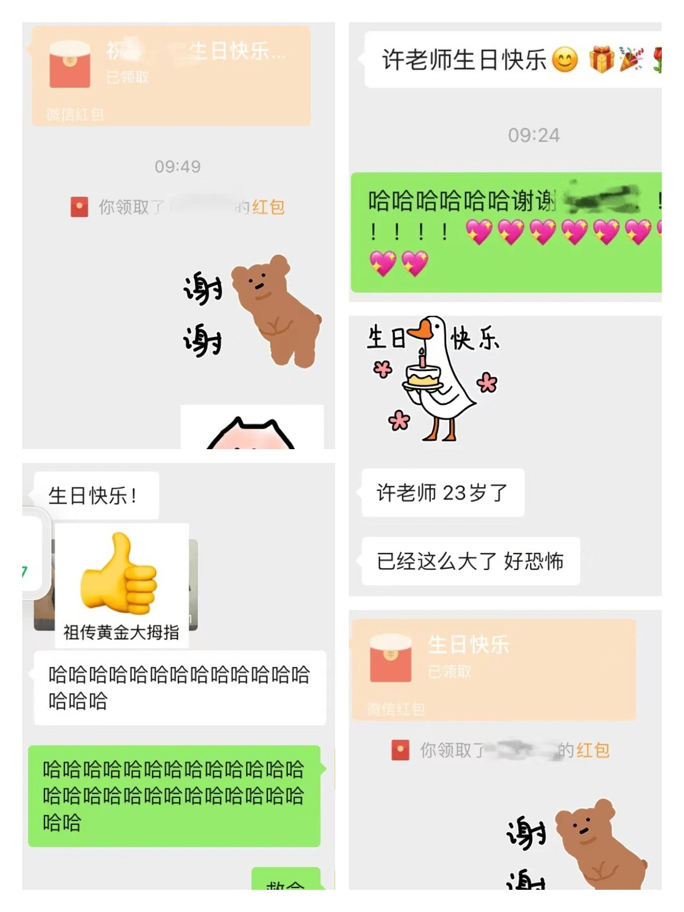

## 5.8
> 今天作为面试官面试了一个人，第一次做面试官，也没有好好准备，所以中间很多时候在卡壳想问题，好在最终还算愉快地聊了45分钟。
1. 加了豆瓣财组的asuraa，然后加了她的群，入群好严格哦，还是要逼自己关心钱，算了一下我的净资产，比起上一次算根本没有在涨......，也不知道钱都花在哪里了，明明一直被关在家里。

2. [关于移民的仓库](https://github.com/acacess/awesome-immigration)更新了。

3. what the fuck???→[sexn](https://www.sexn.finance/)

4. 一个非常详尽的[机器学习求职资源资源列表](https://hollow-wood-560.notion.site/Coding-questions-FAANG-prep-9cdf280e5f30425fa188cbbaa6d1998c)，主理人拿到了 Google / Meta / Snap / Yelp 等大厂的 offer，最终以机器学习工程师的身份加入 Google 苏黎世办公室。

---
## 5.9
> lff又生病了，我好可怜她，怎么会这么惨，身体真的是活着的最重要根基，要好好养生啊！我再一次感受到她的孤独和无助，但我无法有效地鼓舞她，因为我关于意义的逻辑也是一片混乱，好希望我是e人，e人真的可以拯救现实世界，至少让它看上去是积极向上的。看完了B站一个10集35分钟au教程，打算之后再看看别的教程，录混音领域的资料好难找啊。晚上看了上话19:30直播的万尼亚舅舅，太悲伤了。

1. 有受brett的启发想做一点点简单的副业，比如帮人/小公司做网站之类的哈哈哈哈，当然其实更想自己做一点好玩的web产品，但是暂时没有一个具体的想法。**首先是一个idea，然后才是工具。** # 艺术，杂志，网站，weiyi，游戏。

2. 小武（电台）老师：[一个躺平主义者关于工作意义的观点](https://t.me/littlelittlehuman/57)

---
## 5.10
> 我生日！收到很多祝福！嘿嘿嘿🥰🥰🥰希望lff情绪可以好一点。

1. [发现一个很可爱的人：椒盐豆豉](https://womenoverseas.com/t/topic/10564/3)

2. 中国法律快查手册app

3. [Retool 低代码工具](https://sspai.com/post/73013)

---
## 5.11
> 希望lff情绪可以好一点。今天吃到了肯德基的外卖！！！啊啊啊啊啊啊啊啊我爱吮指原味鸡！！！
1. 一直在和cxx讨论如何可以帮到lff，关于她的情绪状态，真的非常非常非常害怕那些轻生的想法，cxx帮我问了很多同学朋友，也收集到了关于自杀干预的热线和信息，后来我们开始聊到了每个人都有必要参加一下自杀干预课程，一整天，一般是政府的心理中心组织的，但我们俩在网上怎么找都找不到。我想到了很多在NGO工作的朋友（虽然主要是工会方面的），他们从前两年开始就过得不太好，资金流入少，机构难以运转，只有少数人在强撑着，向外努力寻求援助。位于权力中心的人的大脑有多么的独断、野蛮，大家都明白。上野千鹤子说要『创造一个弱者也可以生存的社会』，至少现在的中国正在精确地背道而驰中。

---
## 5.12
>晚上lff情况不大好，打了120去医院了，但是医院没有毯子，只能睡在急诊地椅子上面，结果她一晚上都没睡着。
1. 发现了[Netflix新出的纪录片Our father](https://movie.douban.com/subject/35872405/)，讲的是一个妇产科男医生繁殖狂的故事，好呕但是好想看。

2. 闭关锁国ing！移民出国都变得困难，什么事啊都是，最可怕的是我已经麻木了，我不觉得意外，毕竟疫情时期出的各种洋相实在太过虚幻，什么都不足为奇，dream一个权力结构的坍缩崩坏。

---
## 5.13
> 努力工作的一天，中午外卖了140块的零食，结果今天一天就吃完了一半！我有罪！就不该放在我房间里，但如果放外面一定会被我爸吃完的！他是真的猪！晚上补了两个学画画的视频，居然用了一小时sos
1. www快回来了！6.2！今天也稍微聊了一下关于她找工作的事情hhh真不容易啊！

2. 问cxx要了2018年混凝草的照片，那时候我看上去好年轻啊，那时候好快乐啊，这样的日子再也不会有了。

3. 永远不要和男的讨论女权主义，再次刻烟吸肺。

---
## 5.14
> 周六咯！中午起床，随便吃了点，发现之前托小区志愿者配的药没配到，社保卡被退回来了，下午和妈妈视频了一下，然后打扫了一下房间，之后一直在做粘土冰箱贴，做到4点钟，一个流泪马尔济斯，一个流泪小黄鹦鹉，做的时候功放在循环播放kirinji的cherish，然后就是现在，在整理这周的周记hhh，本周中间几天因为处理朋友的病的缘故没有记日记，所以需要回忆和补一下。