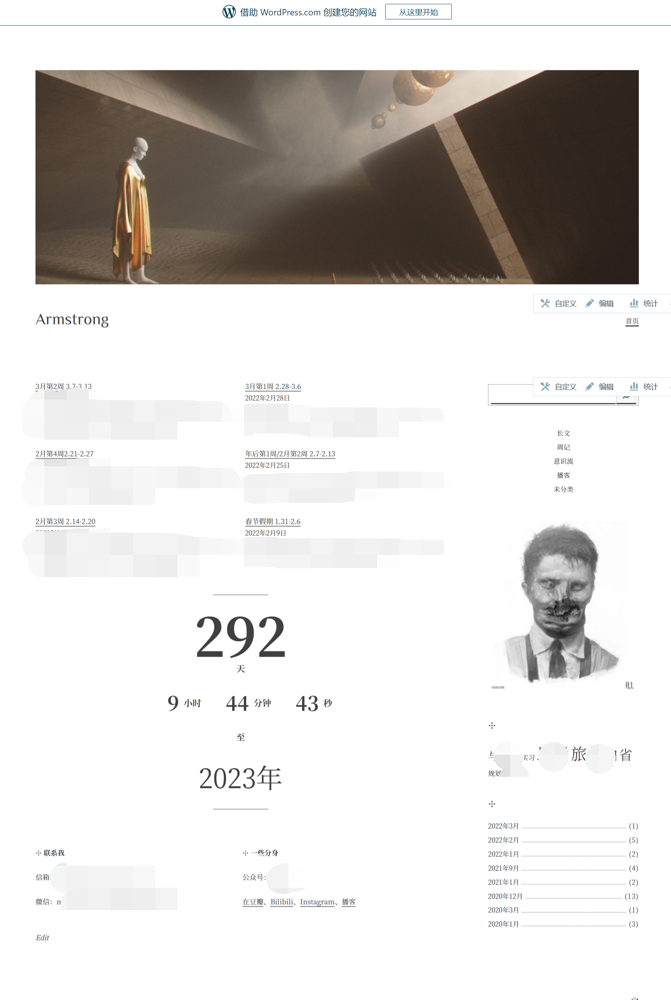
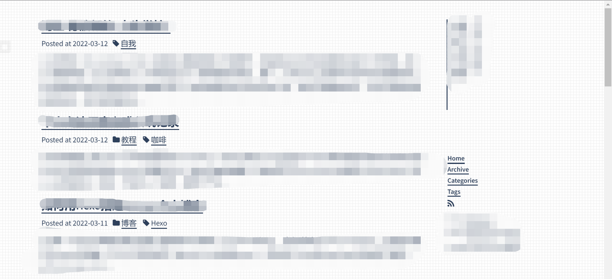

## 前言
如你所见，你正在阅读的这篇文章所属的网站是我的个人博客之一，它使用hugo这个静态博客框架搭建起来并托管于vercel。我一共尝试过3种框架，分别是wordpress、hexo和hugo。我不是学计算机的，代码基础基本为零，但也可以用几个小时就搭起来一个博客网站。这篇文章就用来记录一下我的3次试水，不作技术讲解，仅仅叙述经历。

## Wordpress
我在17年上网冲浪的时候了解到了[wordpress](https://wordpress.com/)，然后按照网上的教程一步步搭了一个简易版本的个人博客，全程不用下载任何工具到本地，全部是在线操作的，还被分配到了一个免费的域名。你可以在wordpress后台的外观选项里面自定义主题，也是全程在线操作，通过拖拽的方式修改页面布局，非常傻瓜式操作。然后，你就拥有了一个看上去还不错的个人博客。
如何写博客呢？你只需要在你的网站右上角点击撰写图标，然后就可以在线写文章了；如果你下载了wordpress的手机app，你可以在手机上写文章，并且更新到你的网站。
* 我的wordpress网站大概长这样：

但正因为wordpress把所有你应该做的事情全都一站承包了，你对个人博客的主权、控制权也减少了，一个例证是wordpress会在你的网站投放广告，并且有很多收费的高级服务。

## Hexo
接触到hexo是因为我关注的一个博客主的个人博客就是用hexo搭建的，然后我就去学着网上的教程也自己搭了一个hexo个人博客。关于搭建过程，我写了一篇文章作了很非技术不易懂的说明，因为也没搞懂它的全部细节，只是依葫芦画瓢。但大体上，你的所有文章是在本地写的，关于个人博客项目你在本地会有一个文件夹保存着项目相关的所有代码，并且我的hexo博客是通过github pages来托管的（hexo部署到github的时间会比vercel慢很多）。
* 我的hexo网站大概长这样：

## Hugo
接触到hugo是因为不满意hexo的themes设计（我在hexo用的theme包括maupassant和makito），然后上网冲浪的时候看到一个博主对hugo的一个theme进行了魔改，然后依然依葫芦画瓢搞了一个hugo+vercel的个人博客，也就是现在你在看的这个网站。
hugo和hexo一样都属于静态博客框架，所以本地也有一个文件夹，你通过本地撰写markdown文件，上传部署，来发布博客。
在使用感受上唯二的区别就是theme的美观程度（并没有说hexo theme丑的意思，我本来接触到的themes就很少，只是我刚好觉得hugo的现在这个theme比较符合我的审美）和托管服务的便捷程度（github pages vs vercel）。

## 小结
* 如果你对于这篇文章的语言毫无头绪，基本看不懂或者不想学习，你可以使用wordpress。（或者付费让我帮你远程搭建！（笑）
* 如果你对于这篇文章的语言可以看懂60%-70%，并且有做一个个人博客的意愿，推荐你使用hexo、hugo做一个自己的个人博客，并且给这篇文章留言告诉我！
* 如果你觉得这篇文章写得太垃圾了，建议你钻研一下hexo/hugo/react-static/纯手动开发，然后留言告诉我如何和你成为朋友！