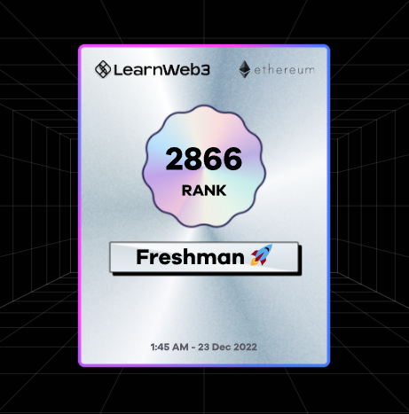
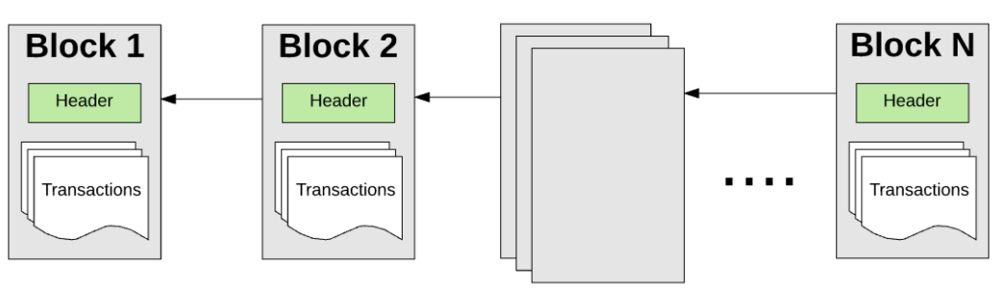

- 12.23 一个下午在[LW3](https://learnweb3.io/)学完了freshman的课。一共四个级别，freshman、sophomore、junior、senior。打算之后一段时间学完sophomore，毕竟第二级的课程内容是我觉得学完后会达到挺厉害的水平的了。
- 以下记录一些freshman级别的知识，大多比较apparent，重在形成一些惯常的web3语言体系，理清基础的概念。其次会记录一下freshman级别的3个小作业。

---
## Notes

> what is a blockchain?
- A distributed database running on a peer to peer network of nodes.
	
- cryptocurrency assets stored in 1000's of blockchain nodes.

> what is web3?
- Web1: Read 📖
- Web2: Read-Write 📖 🖊️
- Web3: Read-Write-Own 📖 🖊️ 🔑

> what is eth?
- Smart Contracts
	- soul of ETH
	- Smart contracts are small computer programs that are replicated and processed on all the computers on the Ethereum network without a central coordinator. Smart Contracts allow you to program contracts that can be automatically enforced by computer code.
- ERC20 Tokens
	- people can create and use their own currencies on Ethereum. The most common form of currency is ERC20 tokens. ERC20 Tokens are smart contracts that fit a specific **standard**.
- ERC721 and ERC1155 Tokens
	- These are what are also called NFTs. These two standards, similar to ERC20, provide a base line for what requirements should be met when creating NFTs.

> Remix and Solidity
- Remix
	- [Remix](https://remix.ethereum.org/): Ethereum IDE.
	- Remix helps you write Solidity code directly in the browser, and has tools for testing, debugging, and deploying your smart contract to the blockchain.
- Solidity	 
	  - Solidity is an object-oriented, high-level language for implementing smart contracts. It is designed to target [Ethereum Virtual Machine(EVM)](https://coinmarketcap.com/alexandria/glossary/ethereum-virtual-machine-evm)

---

## Build your first dApp
[original tutorial](https://learnweb3.io/courses/9a3fafe4-b5eb-4329-bdef-97b2aa6aacc1/lessons/1d8fc04a-af1b-4680-ac8b-755825d84ccc)
### basics
- Goerli: one of etherums' testnet. the dApp we gonna make will run on it (tbh, it is the smart contracts meanwhile the code of our dApp that will be passed through nodes of this testnet).
- Faucet: the channel where you get fake eths to make your dApp work (deploying your dApp on Goerli needs cost, in this case eths).  
- http server: we gonna make a html webpage. so we need a http server that provide service to make our webpage run on our browser.
- Wallet: here we use metamask.
### Create a basic HTML web page (Web2 knowledge)
- we use VSCode and html/CSS to work. finally we will get a index.html file. 
### Create a basic Solidity smart contract
- we use Remix and Solidity to work. finally we will get a smart contract, aka, mood.sol file. 
- we use metamask wallet, and through it we can deploy mood.sol file on Goerli network. the deployment has cost, aka, we need to pay fake eths for doing that.
### Connect the web page with the smart contracts using Ethers.js.
1. in index.html, use scripts tags to import ether.js package into our file.
2. in index. html, add contract address and ABI code(in Remix we can find this 2 info) to build connections.
3. in index.html, define ether provide, in this case, Georli.
4. in index.html, add functions code to call our smart contract functions. and connect our functions to our html buttons.
### Done!

---

## Build your own cryptocurrency
[original tutorial](https://learnweb3.io/courses/9a3fafe4-b5eb-4329-bdef-97b2aa6aacc1/lessons/7296fe93-c7c0-4ea6-a986-ddb40274227f)
### basics
- it is about how to create and deploy an `ERC-20` token on Ethereum.
- we don't need VSCode this time. we only need metamask and Remix.
- since  `ERC-20` offers a standard, the whole thing is about to follow the rule.
- finally we will be able to import our token in metamask and see our assets.
- [OpenZeppelin](https://openzeppelin.com/) : develops reference contracts for popular smart contract standards which are thoroughly tested and secure. Whenever implementing a smart contract which needs to comply with a standard, try to find an OZ reference implementation rather than rewriting the entire standard from scratch.
- mint: `_mint` is an `internal` function within the `ERC20` standard contract, which means that it can only be called by the contract itself. External users cannot call this function. Since you as the developer want to receive some tokens when you deploy this contract, we call the `_mint` function to mint some tokens to `msg.sender`.

### Writing the code
- we use Remix and Solidity to work. finally we will get a .sol file. 
1. import `ERC-20` standard from OZ.
2. write contract
### Compile and Deploy
- In Remix, we click compile to compile our contract and click deploy to deploy. 
- when deployting, input the token's name and symbol following standard.
- we pay with fake eths through metamask to deploy our contract.
### Viewing Tokens in Metamask
- add in metatask the address of our deployed contract and you will find the token in your account and see the balance as well.
### Done!

---

## Build your own simple NFT
[original tutorial](https://learnweb3.io/courses/9a3fafe4-b5eb-4329-bdef-97b2aa6aacc1/lessons/017e65bf-2a86-455e-a499-09b61ffa5241)
### basics
- you have to install Node.js at first.
- [Hardhat](https://hardhat.org/) : an Ethereum IDE and framework. You can write your smart contract, deploy them, run tests, and debug your code.
- [QuickNode](https://www.quicknode.com/?utm_source=learnweb3&utm_campaign=generic&utm_content=sign-up&utm_medium=learnweb3): a node provider that lets you connect to various different blockchains. We will be using it to deploy our contract through Hardhat.

### Build
1.  setup a Hardhat project with your terminal. namely, create a new folder and install npm and hardhat toolbox in it.
####  Write NFT Contract Code
1. use npm tp install OZ contracts (cause NFTs are contracts following some standards and we need some templates.)
2. In the contracts folder inside the pj folder, create a new Solidity file called NFTee.sol.
3. Like PJ2, in NFTee.sol, we import ERC721contracts thorugh OZ, and write contract code. 
4. use npx to compile our contract.
### Configuring Deployment
1. using `.env`, `deploy.js` and `hardhat.config.js`, we give info about our quicknode http provider and our private key in Goerli network.
2. use npx to run the `deploy.js` file to deploy our NFT in Goerli.
### Done!