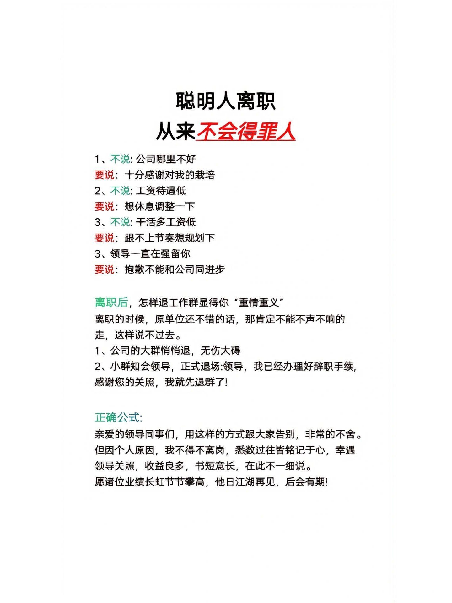

## 元工具
* [阿虚同学的储物间](https://axutongxue.com/)
* [RSSHUB](https://docs.rsshub.app/)
* [在线工具](https://tool.lu/)
* [豆瓣资源菊个站](https://ujuji.com/u/juzhang)

## 我的常用
### 书
* [Zlibrary](https://zh.z-lib.org/)
* [鸠摩](https://www.jiumodiary.com/)
* [libgen](http://libgen.rs/)

### 文件转换
* [smallpdf](https://smallpdf.com/)
* [ilove+anything](https://www.iloveimg.com/)
- [任意东西转二维码](https://cli.im/)

### 学习
* 元学习
	* [B站](https://www.bilibili.com/)
	* [油管](https://www.youtube.com/)
* [CMUInd.S](http://oli.cmu.edu/independent-learner-courses/)
    - 同理基本所有大学都有类似的网站
* 国内syllabus分享计划
	* [浙大](https://github.com/QSCTech/zju-icicles)
	* [清华计算机](https://github.com/PKUanonym/REKCARC-TSC-UHT)
	* [北大](https://lib-pku.github.io/)
	* [上交计算机](https://github.com/kxxwz/SJTU-Courses)
	* [中科大](https://ustc-resource.github.io/USTC-Course/)

## 其他【备忘】
* everything：检索
* fences/元气桌面：桌面整理，后者功能捆绑太多，但还挺好用
* obsidian/atom：用于本地markdown文件管理和编辑
* notion：用于笔记管理
* neat converter：用于kindle文件格式转换
* win10自带的xbox game bar：录屏
* deepl的PC版：快捷键ctrl+c+c弹出翻译框
* custom cursor：鼠标光标样式自定义
* processon：在线的可替代visio的画图网站
* chrome内ctrl+F：网页内搜索高亮
* pocket：收录glimpse

## 生活小妙招
* 拉屎：[B站小视频](https://www.bilibili.com/video/BV1G94y1S7U7/?spm_id_from=333.999.0.0)
* 痛经：[B站小视频](https://www.bilibili.com/video/BV1y44y1u7qv/?spm_id_from=333.999.0.0)
* 肩酸：[B站小视频](https://www.bilibili.com/video/BV127411A7fZ/?spm_id_from=333.999.0.0)
* 国内旅行平替：[B站小视频](https://www.bilibili.com/video/BV1rM411U7o6/?spm_id_from=333.999.0.0)
* 催经：[B站小视频](https://www.bilibili.com/video/BV1Wq4y1V7DX/?spm_id_from=333.999.0.0)
* 离职用语：
* 涨薪话术：[豆瓣](https://www.douban.com/group/topic/279930072/)
* 广州好吃的：[豆瓣](https://www.douban.com/group/topic/272040741/?_i=46605692dZkXqH)
* 父母养老：[豆瓣/但疑似广告](https://www.douban.com/group/topic/260110189/?_i=46606532dZkXqH)
* 免费看medium文章：
	1. 在推特上搜索Medium文章标题，再点进去看。
	2. 把文章分享到推上再阅读.
* 长沙好吃的：[豆瓣](https://www.douban.com/group/topic/224129906/)
* 英文邮件礼貌tips：[豆瓣](https://www.douban.com/group/topic/228260824/?_i=46611232dZkXqH)
* 增加多巴胺：[豆瓣](https://www.douban.com/note/705038979/?_i=46611912dZkXqH)
* 增加内啡肽：[cleveland clinic](https://my.clevelandclinic.org/health/body/23040-endorphins)