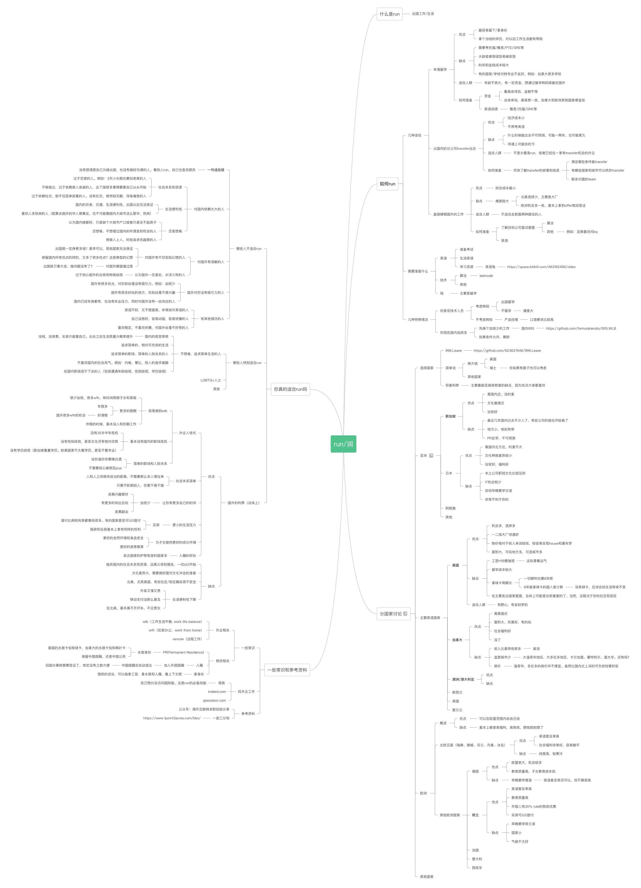

## 信息源
1. [reddit-iwanttorun](https://www.reddit.com/r/iwanttorun/)
2. [reddit-expats](https://www.reddit.com/r/expats/)
3. [reddit-iwantout](https://www.reddit.com/r/IWantOut/)
4. [run学](https://github.com/The-Run-Philosophy-Organization/run/tree/main/%E6%B6%A6%E5%AD%A6%E6%96%B9%E6%B3%95%E8%AE%BA/%E5%90%84%E5%9B%BD%E9%80%89%E6%8B%A9)
5. [awesome-immigration](https://github.com/saladassisme/awesome-immigration)

---
## 移民思维导图

---
## 大家的经验
- [google-excel](https://docs.google.com/spreadsheets/d/1L-6jRn7Vh5QqYrVQAwcLI0wDZcdEOMFCclQGs4kRMYY/edit#gid=0)
- [分享下我的跑路路径，确实可行但九死一生](https://www.reddit.com/r/iwanttorun/comments/tyg1e5/%E5%88%86%E4%BA%AB%E4%B8%8B%E6%88%91%E7%9A%84%E8%B7%91%E8%B7%AF%E8%B7%AF%E5%BE%84%E7%A1%AE%E5%AE%9E%E5%8F%AF%E8%A1%8C%E4%BD%86%E4%B9%9D%E6%AD%BB%E4%B8%80%E7%94%9F/)
- [给非码专业的朋友们推荐一个跑路的另类选择-意大利](https://www.reddit.com/r/iwanttorun/comments/texoco/%E7%BB%99%E9%9D%9E%E7%A0%81%E4%B8%93%E4%B8%9A%E7%9A%84%E6%9C%8B%E5%8F%8B%E4%BB%AC%E6%8E%A8%E8%8D%90%E4%B8%80%E4%B8%AA%E8%B7%91%E8%B7%AF%E7%9A%84%E5%8F%A6%E7%B1%BB%E9%80%89%E6%8B%A9%E6%84%8F%E5%A4%A7%E5%88%A9/)
- [AMA加拿大留学移民月经贴](https://www.reddit.com/r/iwanttorun/comments/u54z3t/ama%E5%8A%A0%E6%8B%BF%E5%A4%A7%E7%95%99%E5%AD%A6%E7%A7%BB%E6%B0%91%E6%9C%88%E7%BB%8F%E8%B4%B4/)
- [AMA 低成本run欧洲经验分享](https://www.reddit.com/r/iwanttorun/comments/tvv2oh/ama_%E4%BD%8E%E6%88%90%E6%9C%ACrun%E6%AC%A7%E6%B4%B2%E7%BB%8F%E9%AA%8C%E5%88%86%E4%BA%AB/)

---
## Run北美全指南

### 美国篇

对大部分人来说，目前run美国只有两种方法：投资移民（EB-5）或者留学-找工作-公司申请绿卡。美国纯粹的技术移民路线非常困难，可以简单说说，但是符合这个条件的人估计也不会在本sub玩。

**投资移民（EB-5）**

目前投资移民的门槛是90万美元（高失业率地区）和180万美元（其他地区）。投资移民不等于花钱买绿卡。大体上说，就是你拿着90万美元到美国去投资一个公司或者店。在赴美之后的两年内，你的公司或者店要雇佣至少10个美国人或者居民。这个条件有无数的移民中介可以帮你达到，但是相应的得花钱。具体要给移民中介花多少钱我不太了解，但是我估计5位数美金是少不了的。目前EB-5的排期是6年，总体至少要10年才能拿到绿卡。

投资所用的90万美元必须是能够证明合法来源的。所谓合法来源在美国体系中就是说纳过税，或者可以证明不需要纳税的钱。比如工资，卖房子，投资收入等等。如果你的钱来路不明，建议先去洗钱。

**留学-工作-绿卡 (EB-2/EB-3)**

我个人认为这是目前除了野路子和土豪之外唯一能run美国的路线，也是最适合不到35岁的年轻做题家的路线。如果你家庭条件允许并且本科还没毕业，那么尽快安排转学事宜才是最明智的选择。如果你本科即将面临毕业或者已经毕业，那么抓紧准备考托福和GRE或者GMAT吧。这条路只要35岁以下都还是可以走得通的。

首先，要选择这条路，钱是必须要准备的。根据地区和专业，美国一年的学费是4到6万美元，生活费包括房租水电网吃饭交通一个月大概需要1500到3000美元不等。如果你特别能省钱的话也许1000美元一个月也能安排下来。

其次是选学校和专业。选学校只有一个标准：location。为了留在美国，你的学校必须是招国际生的大公司的target school。除非学校排名特别好，在中部大农村的学校很难成为target school。倒不是说不是target school就找不到工作，只是非常困难，因为不在大城市周边的学校比较少有networking的机会，也就比较难找工作。在大城市周边的学校，就算排名很差也有很多networking机会，降低找工作的难度。比如湾区的（非著名）名校San Jose State University SJSU，这个学校名不见经传，但是去湾区大IT公司的毕业生奇多，就因为SJSU坐落于硅谷中心地带。去SJSU肯定比去Washington University in St. Louis WUSTL找到工作的概率要大，虽然WUSTL比SJSU的排名要高很多。美国的本科和研究生毕业各有一次Optional Practical Training OPT的机会，所谓OPT就是给你一个工作许可让你在美国可以合法的工作。非STEM专业的OPT时间是1年，STEM专业是3年。现在有的项目为了满足STEM的要求随便给你安排一点统计，编程的课程，比较适合文科转行。在选专业的时候要注意是不是STEM专业。尽量选择STEM，可以用3年的OPT。至于为什么要追求3年的OPT，看下面这部分。

然后是找工作。留学生最终需要得到的美国的工作签证叫H1B，这个签证是抽签的，并且需要雇主的担保才能进行抽签。所以在OPT期间你必须/找到一家能够支持H1B抽签的公司。H1B一年一抽，如果是1年的OPT你就只有1到2次抽签机会。如果是3年的OPT就有3到4次。中签率我很久没关注了，很久之前是研究生80%本科生60%，现在只能更低不会更高。没有美国身份找工作是比较困难的，首先小公司不会sponsor H1B，因此面试的时候直接就排除国际生了。其次因为登子的H1B新政，H1B抽签开始有薪酬要求了。具体的要求我没关注，大概就是卡的很高，除了IT大公司基本达不到的那种水平。也就是说，这条路要求你到美国学的专业必须是CS，否则几乎不可能run成功。

然后漫长的打工和绿卡排期过程。目前EB-2的排期是5年。不算留学和进入绿卡申请流程的时间，前后大概需要8到10年可以拿到绿卡。

**纯粹的技术移民 (EB-1)**

纯粹的技术移民大概就是特殊人才那种路子，我没接触过这样的人，估计如果钟神袁神之类的人要跑路美国可以走走这条路子。你如果拿个诺贝尔奖啥的估计就可以走这条路了。或者就是美国公司给你发L1签证，除非你是公司的核心人才，否则没有公司愿意帮你办这逼事。这个是不需要排期的，随时提交申请随时可以run。能走这条路子的人估计也不会来本sub玩吧，就不多写了。

### 加拿大篇

run加拿大的难度比run美国要低多了，但是代价就是加拿大天气冷，收入没美国高，比美国更加无聊一点。

**投资移民**

不太了解，加拿大投资移民门槛挺高的，有这个钱基本都投资移民美国了。这里就不多说了。
补充加拿大投资移民的一些内容：

加拿大的联邦投资移民项目在几年前已经关闭了，现在纯粹能交钱就能拿到身份的只有魁北克自己的投资移民项目，但是极其不推荐，因为申请周期太tm长了，和eb5排期差不多，而且即便拿到身份后定居意向只能在魁北克。

其他各省的“投资移民”项目都是要真创业，不是说只投钱就行，造假基本上没戏。当然了这不是没有好处：确实是想创业的去偏远地区（不一定是偏远省份，on bc也有很偏的地方要）不用花很多钱到头来是可以拿到身份的。

> TN签证也需要雇主sponsor

这么说是不准确的。职位符合清单列表的话tn签证需要的基本上只是一封雇主信不需要sponsor，当然如果不是在清单列表上但是硬凑的那大概率需要律师跟着一起过关。

tn签证的坏处之一是持有者不能有dual intent即移民倾向。言外之意就是持有者不能仅靠tn签证移民美国，需要转到有dual intent即移民倾向的签证比如h1b，到头来还要抽签。不过tn签证的获取和延期理论上是无限的，所以基本上最后都能抽到。

**留学-工作-绿卡**

目前是留学移民加拿大的黄金时机。加拿大几乎是读书就送绿卡。目前的政策是只要在加拿大完成八个月以上的学业（本科研究生专科都可以，只要是政府认证的机构），就可以发和学业时间相等的毕业工签。如果学业时间超过2年就可以发3年的工签。只要找到工作，这段时间足够你完成加拿大的绿卡申请程序。

首先从花费的角度，加拿大留学花费跟美国差不多，参考上面吧。但是加拿大有一个好处，学生是可以合法打工的，每周可以打工20小时。按照最低时薪12块钱算，一周也能赚240了，一个月下来付个房租没问题。

其次学校和专业，还是推荐大城市及周边的学校。专业的选择余地比美国要大很多。在办理加拿大移民程序的时候有一个[移民职业名录](https://www.canada.ca/en/immigration-refugees-citizenship/services/immigrate-canada/express-entry/eligibility/find-national-occupation-code.html)可以参考，名录里的0, A, B类型都可以移民。只要是需要一点点技术的工作比如电工，厨师这样的都可以自己办移民。所以你的专业可以根据职业名录结合自己的技能和兴趣来挑。收入最高最容易找工作的当然还是IT行业，但是其他行业也不是不行。

通过留学移民加拿大通常都是走的Express Entry里的Canadian Experience Class。CEC的邀请分数基本都在420分以上，今年还有一次邀请了所有人，只要75分就可以拿到。网上有很多EE打分计算器可以自己去测评一下，我大概算了一下达到420分最低需要这样的要求：

-   年龄40岁以下（年龄越小分越高）
    
-   本科学历（不要求加拿大）
    
-   加拿大学历（一年以上学制）
    
-   雅思8/7/7/7，或者CELPIP 9/9/9/9
    
-   加拿大工作经验1年以上+海外工作经验1年以上（NOC里的0，A，B类）
    

这样的条件是425分，运气好的话可以碰到捞人的及格线。如果是跟配偶一起申请并且条件跟你一样大概可以多拿几分。

**纯粹的技术移民**

如果没有加拿大的留学和工作经验一样可以进入Express Entry的池子，走的是Federal Skilled Worker FSW项目。这个项目发邀请的次数没有CEC那么频繁，分数也比较高一点。按照以往经验，440分以上及格的可能性比较大。凑到440分大概需要这样的要求：

-   年龄34岁以下（年龄越小分越高）
    
-   硕士学历（不要求加拿大）
    
-   雅思8/7/7/7，或者CELPIP 9/9/9/9
    
-   海外工作经验3年以上（NOC里的0，A，B类）
    

这样的条件是442分。同样的，如果有配偶且条件类似可以多几分。如果分不够，年龄是没法倒回的，只能刷语言，或者去加拿大读书。

进池子还有一类叫Federal Skilled Trades，专门给技工类工作设置的一个类别。这个类别要求你有加拿大公司提供的LMIA也就是劳动市场评估证明你的职位在本地没有人可以代替，或者你有加拿大政府提供的职业技能证书。这个我估计大多数中国人都没戏。

### 墨西哥篇

不建议run，你会西班牙语么？

美国到加拿大或者加拿大到美国

如果你有美国的学历，但是抽不到H1B想要转投加拿大，这个有路子，但是首先要求你能在美国找到工作，然后帮你转到加拿大的office。这样可以免去工签的问题。然后你有加拿大工作经验了，学历也到位，拿加拿大绿卡就是一年的事情。如果在美国没找到工作，那么我估计你在加拿大也找不到工作，更别提工签的障碍了。

如果你拿到了国籍，那么就可以用TN签证在美国工作。TN签证也需要雇主sponsor，但是没有抽签，比H1B难度小多了。

